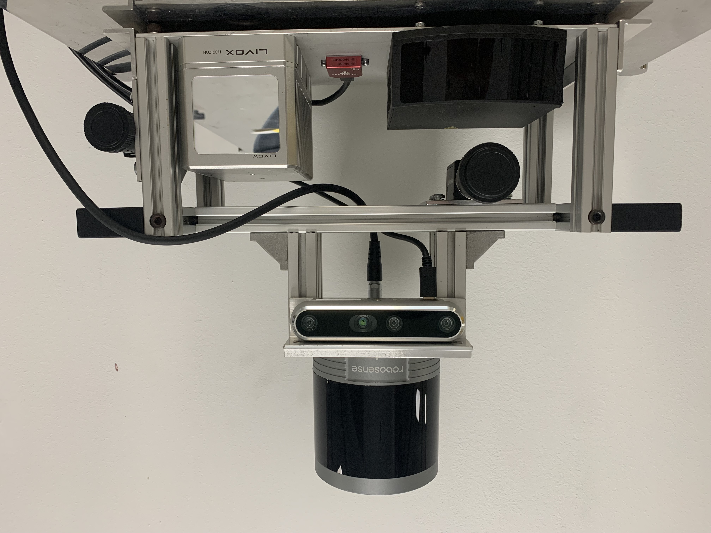

# Livox_localization

***Livox_localization*** is a ROS package for real-time 3D localization using a Livox LIDAR. Our work is based on the work [HDL_Localization](https://github.com/koide3/hdl_localization). This package first estimates the sensor pose from IMU data implemented on the LIDAR by applying Unscented Kalman Filter-based pose estimation, and then performs multi-threaded NDT scan matching between a globalmap point cloud and input point clouds to correct the estimated pose. IMU-based pose prediction is optional. If you disable it, the system predicts the sensor pose with the constant velocity model without IMU information.

We integrate the algorithm on our own dataset with 3d object detection on pre-built map of our previous [repo](https://github.com/yiyihan/Map_Render). 
<!--
We work on 3D Object Detection and Livox_localization for visualizing detected objects on pointcloud maps. Our sensors include

Real-world testing:


Our Sensor Platform:

-->
## Requirements
***Livox_localization*** requires the following libraries:
- OpenMP
- PCL 1.10

The following ros packages are required:
- pcl_ros
- <a href="https://github.com/koide3/ndt_omp">ndt_omp</a>

## Parameters
All parameters are listed in *launch/*.launch as ros params.<br>
You can specify the initial sensor pose using "2D Pose Estimate" on rviz, or using ros params (see example launch file).
You can launch the package by establishing your own launch file.


```bash
rosparam set use_sim_time true
roslaunch hdl_localization *.launch
```

```bash
roscd hdl_localization/rviz
rviz -d hdl_localization.rviz
```

```bash
rosbag play --clock XXX.bag
```


